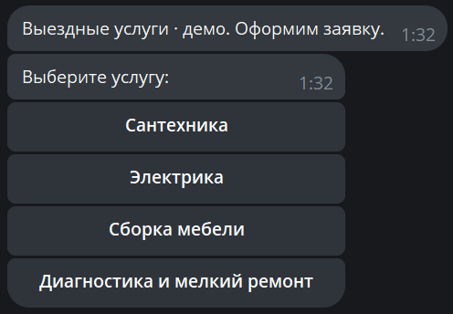
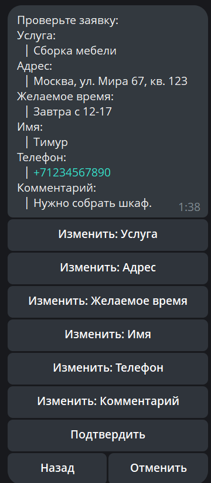
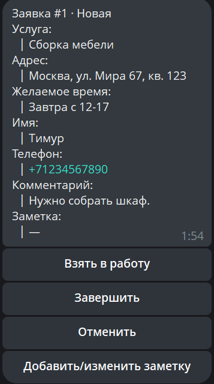
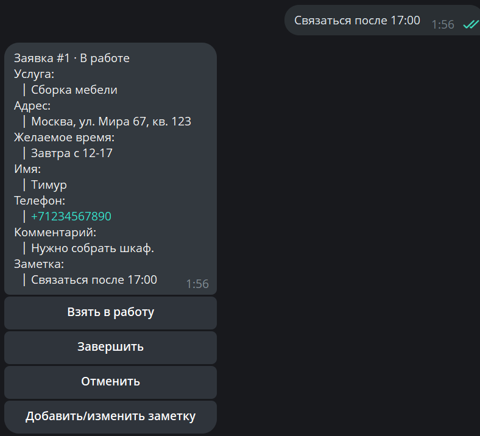

# Telegram Lead Bot + Mini CRM

**Портфолио-проект: локальное демо Telegram-бота для приёма заявок на выездные услуги.** Клиент проходит пошаговую анкету прямо в чате, проверяет и исправляет данные перед подтверждением. Менеджер получает структурированную заявку и ведёт её в Mini CRM: меняет статус, сохраняет заметку и открывает список заявок.

Черновики и заявки сохраняются в SQLite. Если уведомление менеджеру временно не отправилось, заявка остаётся доступной, а сохранённая очередь доставки повторит попытку.

## Сценарий

**Клиент:** выбирает услугу → вводит данные → проверяет или исправляет заявку → подтверждает и получает ID.

**Менеджер:** получает заявку → берёт её в работу → добавляет внутреннюю заметку → при необходимости открывает существующие заявки через `/leads`.

### Клиент

<table>
<tr>
<td valign="top"> Клиент начинает заявку в Telegram: выбирает услугу без отдельной формы.</td>
<td valign="top"> Перед подтверждением собранные данные можно проверить и исправить.</td>
</tr>
</table>

### Менеджер

<table>
<tr>
<td valign="top"> Менеджер получает структурированную заявку с действиями Mini CRM.</td>
<td valign="top"> Та же заявка в статусе «В работе»; внутренняя заметка сохранена.</td>
</tr>
</table>

## Сохранность и восстановление

Незавершённый клиентский черновик хранится в SQLite: после перезапуска бота клиент может продолжить анкету. Созданные заявки, их статусы и заметки менеджера также переживают перезапуск.

Подтверждение заявки сохраняет lead и записи доставки в одной транзакции. Отдельный worker отправляет уведомления из сохранённой очереди и повторяет временно неудавшуюся доставку. Повторная попытка относится к прежнему ID заявки и не создаёт новую заявку. При аварии между успешной отправкой в Telegram и отметкой `sent` сообщение может прийти повторно с тем же ID.

Логика recovery покрыта автоматизированным тестом. Ручная проверка внешнего сбоя Telegram остаётся **`pending controlled external fault injection`**.

## Как устроен проект

- **Handlers** ведут анкету клиента и команды менеджера; доступ к действиям менеджера проверяется по Telegram user ID.
- **Domain logic** проверяет ввод и переходы анкеты.
- **SQLite + aiosqlite** хранят черновики, заявки и очередь доставок.
- **Delivery worker** обрабатывает ожидающие отправки и повторы после перезапуска.
- **aiogram 3** получает updates и отправляет сообщения через Telegram Bot API.

Стек: Python 3.12+, aiogram 3, aiosqlite, SQLite, python-dotenv; для проверок — pytest, pytest-asyncio и Ruff.

## Проверка качества

| Проверка | Результат |
|---|---|
| Автоматизированные тесты | 43 passed, включая восстановление доставки с тем же ID заявки |
| Статический контроль | Ruff lint и format check прошли; `pip check` без конфликтов |
| Зависимости проекта | `pip-audit` не выявил известных advisory при проверке проекта |
| Security/privacy | Аудит завершён; секретов и реальных данных ручного E2E в отслеживаемом коде и истории Git не обнаружено |
| Реальный Telegram | Вручную пройдены анкета клиента, действия менеджера и восстановление после перезапуска |

## Локальный запуск

Нужны Python 3.12+ и бот, созданный через BotFather. Скопируйте URL этого репозитория через кнопку **Code** на GitHub:

~~~powershell
git clone <скопированный-URL>
cd telegram-lead-bot
py -3.12 -m venv .venv
.\.venv\Scripts\python.exe -m pip install -e '.[dev]'
Copy-Item .env.example .env
~~~

Заполните локальный `.env`:

| Переменная | Что указать |
|---|---|
| `BOT_TOKEN` | Токен бота от BotFather |
| `MANAGER_IDS` | Numeric Telegram user ID одного или нескольких менеджеров через запятую; username не подходит |
| `DATABASE_PATH` | Путь к SQLite; по умолчанию `leadbot.sqlite3` в каталоге проекта |

Менеджеру нужно сначала открыть бота и отправить `/start`, чтобы бот мог присылать ему заявки. **Не добавляйте `.env` и базу с заявками в Git.**

Запуск:

~~~powershell
.\.venv\Scripts\python.exe -m leadbot.main
~~~

Проверки:

~~~powershell
.\.venv\Scripts\python.exe -m pytest -q --basetemp=tmp
.\.venv\Scripts\ruff.exe check .
.\.venv\Scripts\ruff.exe format --check .
~~~

## Границы демо и адаптация

Это локальное демо с одним процессом и SQLite. В текущем scope нет web admin, внешней CRM, Redis/Celery, multi-tenant режима и настроенного hosting/systemd deployment. Для работы с реальными клиентами отдельно потребуются размещение, резервное копирование и правила хранения данных.

Под конкретный бизнес можно адаптировать каталог услуг и поля анкеты, добавить бизнес-статусы, интеграцию с Google Sheets или CRM и постоянное размещение. Это направления дальнейшей работы, а не уже реализованные функции.

Операторские действия и резервное копирование описаны в [runbook](docs/runbook.md), принятые решения — в [decisions](docs/decisions.md).
